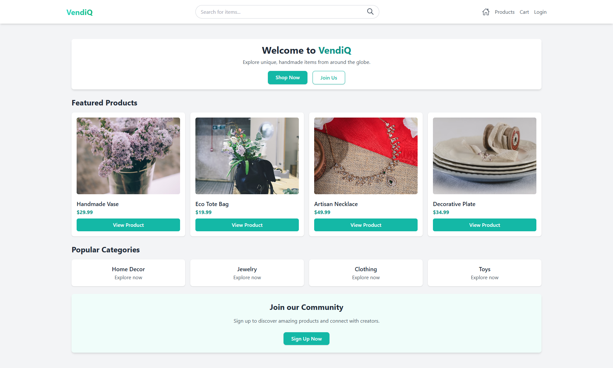
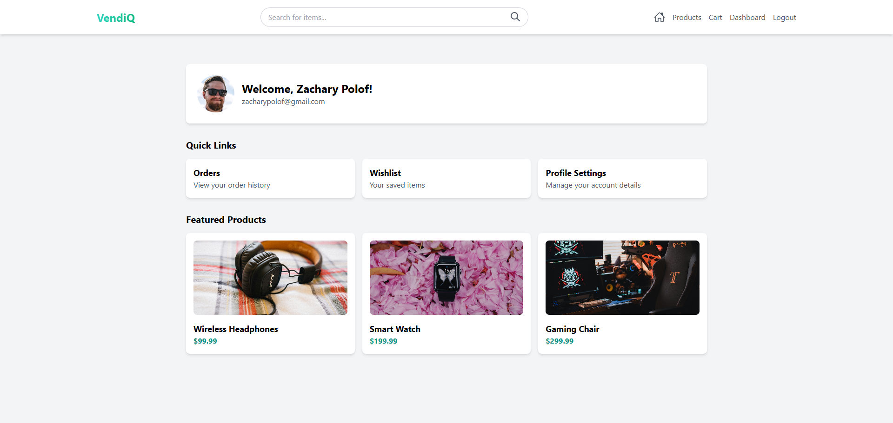

# VendiQ

**VendiQ** is a modern e-commerce showcase project designed to highlight the potential of small-scale, handmade, and niche products. It demonstrates how to create a responsive and feature-rich online shopping experience using the latest web technologies.

## Overview

**VendiQ** is an e-commerce platform designed to showcase the functionality and features of modern online shopping sites. It allows users to browse and manage products in various categories, create a wishlist, and experience a seamless shopping process.

- **Categorized Products**: Explore items in categories like Tech Gadgets, Home Decor, Jewelry, Art, Books, Food & Drink, Clothing, and Toys & Games.
- **User-Friendly Design**: A clean, responsive layout that works seamlessly across devices.
- **Firebase Integration**: Utilize Firebase for authentication, database, and hosting.

## Table of Contents

  
Toggle Contents

  <ol>
    <li><a href="#overview">Overview</a></li>
    <li><a href="#features">Features</a></li>
    <li><a href="#built-with">Built With</a></li>
    <li><a href="#installation">Installation</a></li>
    <li><a href="#usage">Usage</a></li>
    <li><a href="#contributing">Contributing</a></li>
    <li><a href="#license">License</a></li>
    <li><a href="#contact">Contact</a></li>
    <li><a href="#project-link">Project Link</a></li>
  </ol>

## Features

### User Authentication:

- **Login and Register**: Users can sign up or log in to access personalized features.

### Product Browsing:

- **Categories**: Products are organized into user-friendly categories.
- **Search and Filter**: Easily find products using the search bar and category filters.

### Wishlist:

- **Save Favorites**: Users can add products to their wishlist for future reference.

### Shopping Cart:

- **Manage Cart**: Add, update, or remove products from the cart.
- **Checkout Flow**: Simulated checkout process for a complete user experience.

### Responsive Design:

- **Mobile Optimization**: Fully responsive layouts ensure a seamless experience on any device.

(<a href="#vendiq">back to top</a>)

## Built With

  
  
  
  
  
  

(<a href="#vendiq">back to top</a>)

## Screenshots

|  |  |
| :----------------------------------------------------: | :------------------------------------------------------: |
|                  VendiQ Landing Page                   |                  VendiQ User Dashboard                   |

(<a href="#vendiq">back to top</a>)

<!-- ## Demo

(<a href="#vendiq">back to top</a>)
 -->

## Installation

To set up the VendiQ project locally, ensure you have the following prerequisites:

### Prerequisites

- [Node.js](https://nodejs.org/) (v14.x or higher)
- [npm](https://www.npmjs.com/)

(<a href="#vendiq">back to top</a>)

## Usage

### Browsing Products

1. Use the navbar to explore categories or search for specific products.
2. Click on product cards to view details or add them to the cart.

### Managing the Wishlist

1. Add favorite products to your wishlist for quick access later.
2. View and manage your wishlist from the dashboard.

### Simulated Checkout

1. Add products to your cart and proceed to the checkout page.
2. Simulate a complete checkout experience.

(<a href="#vendiq">back to top</a>)

## Contributing

Contributions are welcome! To contribute:

1. Fork the repository.
2. Create a new feature branch (`git checkout -b feature/new-feature`).
3. Commit your changes (`git commit -m 'Add new feature'`).
4. Push to the branch (`git push origin feature/new-feature`).
5. Create a Pull Request.

(<a href="#vendiq">back to top</a>)

## License

This project is licensed under the MIT License. See the [LICENSE](LICENSE) file for more details.

(<a href="#vendiq">back to top</a>)

## Contact

For any questions or support, please contact:

-  [Zachary Polof](https://github.com/IVIonsters)

(<a href="#vendiq">back to top</a>)

## Project Link

- Repo Link: [VendiQ](https://github.com/IVIonsters/VendiQ)
- Live Link: [VendiQ](https://vendiq.web.app/)

(<a href="#vendiq">back to top</a>)

